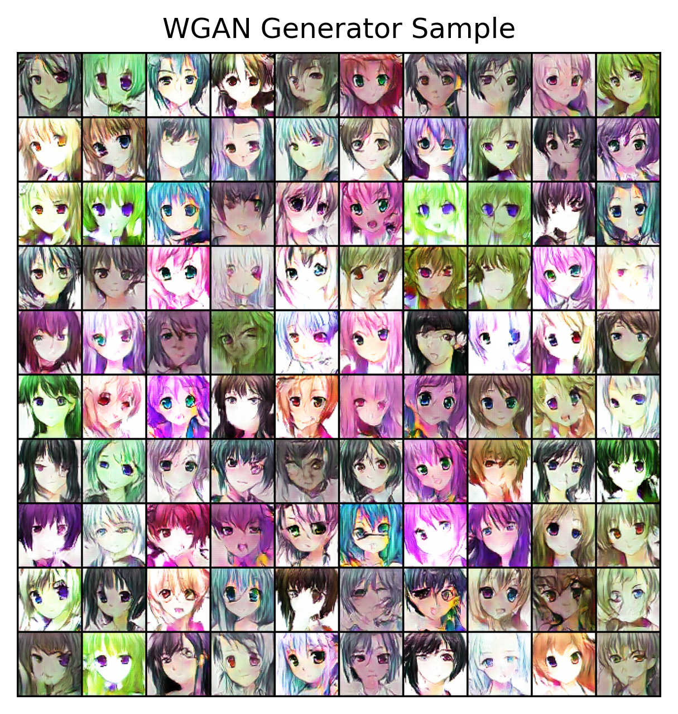
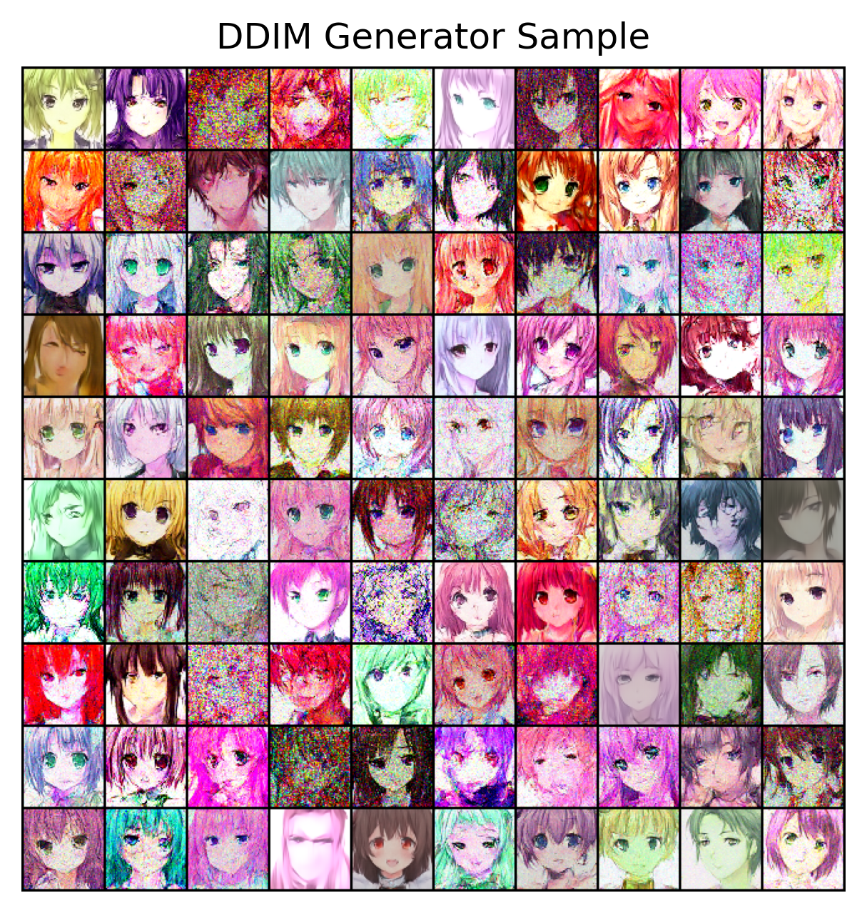
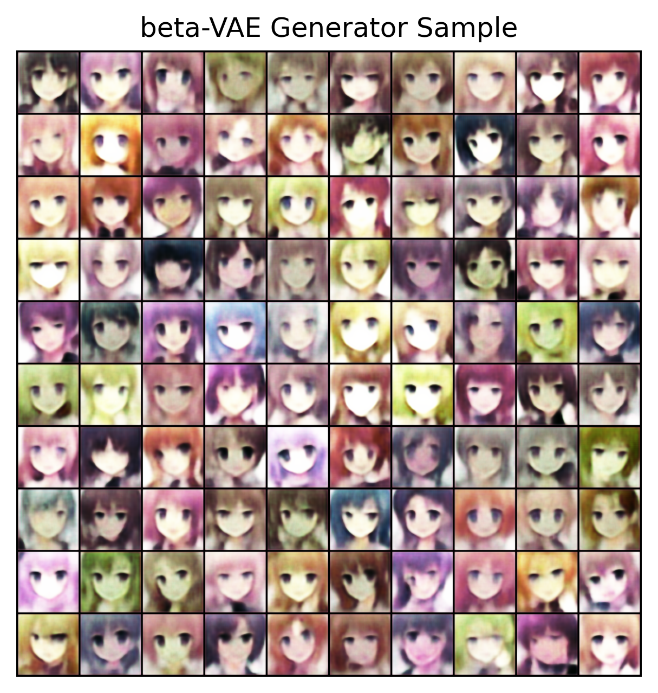
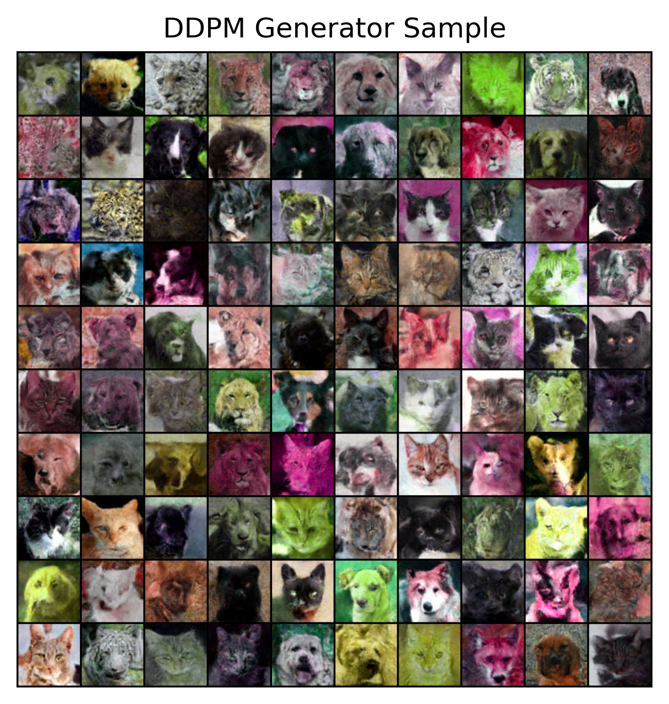

# ImageGeneratorModel
用于学习的图片生成模型实现，包含GAN,VAE,Diffusion  
部分模型结果：
<!-- 第一行 -->

  
  
  

<!-- 第二行 -->

  
  

代码框架：
		./LinLanDeepLearningFrame/  
		  ├── ImageGeneratorModel/  
		  │   ├── BaseStruct.py  
		  │   ├── DiffusionModel.py  
		  │   ├── GANModel.py  
		  │   ├── Losses.py  
		  │   ├── UnetModel.py  
		  │   ├── VAEModel.py  
		  │   ├── __init__.py  
		  │   ├── functions.py  
		  │   └── utils.py  
		  ├── Tokenizr/  
		  │   ├── BPE.py  
		  │   └── __init__.py  
		  ├── TransformerModels/  
		  │   ├── BaseStruct.py  
		  │   ├── Transformer.py  
		  │   └── __init__.py  
		  └── __init__.py  
在LinLanDeepLearningFrame.ImageGeneratorModel.utils里面包含了各个模型的训练函数，支持混合精度训练

